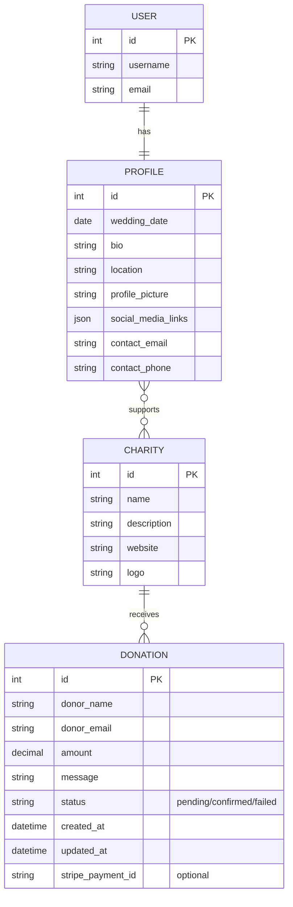
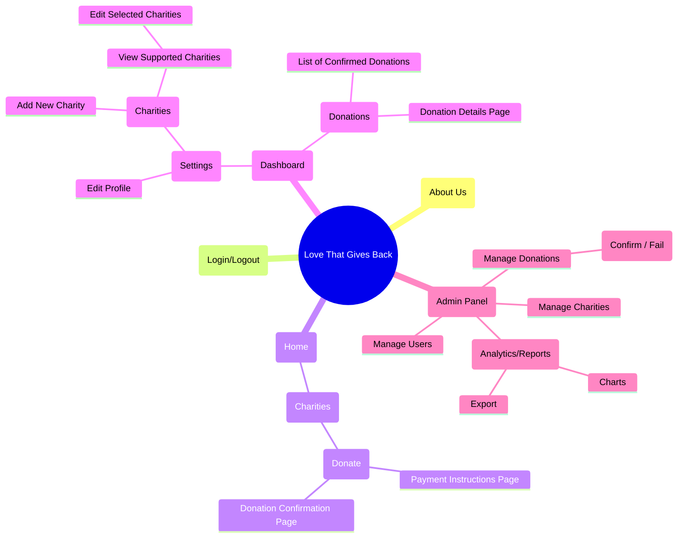
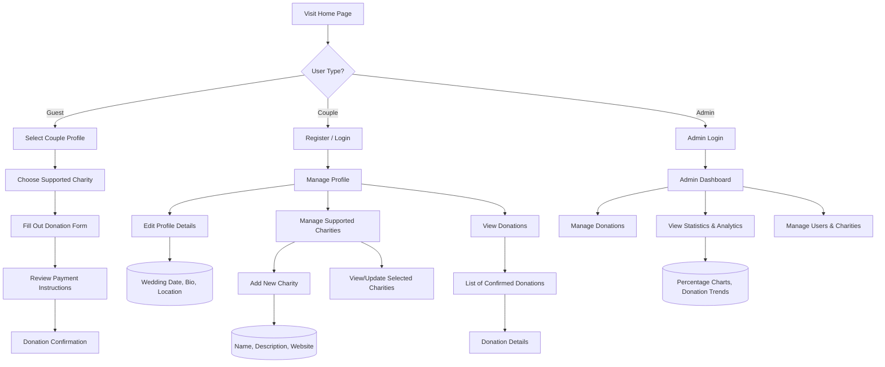

# **❤️ Love That Gives Back**

- [Concept Overview](#concept-overview)
- [Front-End Features](#front-end-features)
  - [Home Page (Landing Page)](#1-home-page-landing-page)
  - [User Authentication](#2-user-authentication)
  - [Dashboard](#3-dashboard)
  - [Charity Pages (CRUD Features)](#4-charity-pages-crud-features)
  - [Responsive Design](#5-responsive-design)
  - [API Integration](#6-api-integration)
- [Back-End Features](#back-end-features)
  - [Django Server](#1-django-server)
  - [Database](#2-database)
  - [User Authentication & Authorization](#3-user-authentication--authorization)
  - [Donation Management](#4-donation-management)
  - [Automated Testing](#5-automated-testing)
- [Tools & Technologies](#tools--technologies)
  - [Front-End](#front-end)
  - [Back-End](#back-end)
  - [Version Control & Deployment](#version-control--deployment)
- [ER Diagram](#er-diagram)
- [Sitemap](#sitemap)
- [User Flow](#user-flow)
- [User Stories](#user-stories)
  - [Guest User (Wedding Guest)](#guest-user-wedding-guest)
  - [Wedding Couple (Profile Owner)](#wedding-couple-profile-owner)
  - [Admin (Superuser)](#admin)

---

## **Concept Overview**  
**Theme:** A platform where users can explore and donate to various charity organizations tied to a couple's values.  
**Objective:**  
- Celebrate love by inspiring generosity.  
- Provide a seamless user experience for exploring charities and donating.  

---

## **Front-End Features**  

### 1. **Home Page (Landing Page)**  
- A hero section introducing the mission.  
- Links/buttons for logging in, exploring charities, and donating.  
- Display the wedding date with a countdown.  
- Highlight charity statistics (e.g., total donations).  

### 2. **User Authentication**  
- Registration: Collect user information (Name, email, password) using Django forms.  
- Login/Logout: Leverage Django’s built-in authentication system with user-friendly views and session management.  

### 3. **Dashboard**  
- Display personalized greetings using dynamic Django templates.  
- Show donation history and progress.  
- Enable users to set and track donation goals through integrated Django views.

### 4. **Charity Pages (CRUD Features)**  
- Showcase multiple charities with detailed descriptions, images, and fundraising goals.  
- Allow admin users to create, update, and delete charity profiles through Django’s admin interface and custom views.  
- Optionally, enable commenting or "likes" on charity pages using Django forms for enhanced engagement.

### 5. **Responsive Design**  
- Utilize Bootstrap along with custom CSS to create a modern, responsive design.  
- Ensure full compatibility across devices with Django’s static files management.

### 6. **API Integration**  
- **External API:** Integrate with external payment processors (e.g., PayPal or Stripe) via Django views to display live donation progress and handle secure payments.

---

## **Back-End Features**  

### 1. **Django Server**  
- Develop a RESTful API using Django Rest Framework for any necessary data interchange.  
- Serve dynamic HTML pages rendered through Django’s templating engine.

### 2. **Database**  
- Use PostgreSQL for scalable and reliable data management.  
- Store user profiles, charity data, and donation transactions securely.

### 3. **User Authentication & Authorization**  
- Secure user login with hashed passwords using Django's robust authentication system.  
- Manage user roles (admin, authenticated user, guest) via Django’s permission framework.

### 4. **Donation Management**  
- Implement CRUD functionality for managing donations through Django views and forms.  
- Generate donation receipts and send confirmation emails using Django’s email utilities.

### 5. **Automated Testing**  
- Utilize Django’s `unittest` framework to rigorously test views, forms, and API endpoints.

---

## **Tools & Technologies**  

### **Front-End:**  
- Django Templates with the built-in templating engine and URL routing.

### **Back-End:**  
- Django with Django Rest Framework for API development.  
- PostgreSQL for database management.

### **Version Control & Deployment:**  
- Git for version control.  
- Deploy the full-stack Django application on platforms like Render or Heroku.

---

## ER Diagram

---

## Sitemap

---

## User Flow

---

## User Stories

### Guest User (Wedding Guest)
- As a guest, I want to view a couple’s profile and supported charities so that I can select one to donate to.
- As a guest, I want to fill out a donation form with my name, email, donation amount, and a personal message so that I can contribute a gift.
- As a guest, I want to review payment instructions and receive confirmation after submitting my donation so that I know my gift is acknowledged.

### Wedding Couple (Profile Owner)
- As a couple, I want to register and log in with a single user account so that I can manage my profile easily.
- As a couple, I want to view my profile details (wedding date, bio, location, etc.) so that guests know more about us.
- As a couple, I want to edit my profile details and update my supported charities so that I can choose which charities are displayed on my profile.
- As a couple, I want to see a list of confirmed donations (filtered by the charities I support) so that I can track the contributions and share my gratitude.

### Admin (Superusers)
- As an admin, I want to log in and view an admin dashboard so that I can manage all donations and user data.
- As an admin, I want to update the status of donations (mark them as confirmed or failed) so that the system reflects the correct payment status.
- As an admin, I want to view overall statistics and analytics (e.g., donation trends, percentages, reports) so that I can monitor platform performance.
- As an admin, I want to manage users and charities so that I can ensure data integrity and handle disputes if necessary.

---

