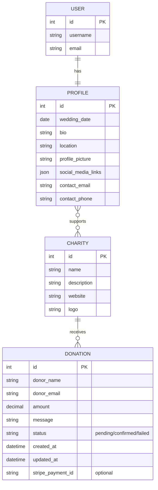
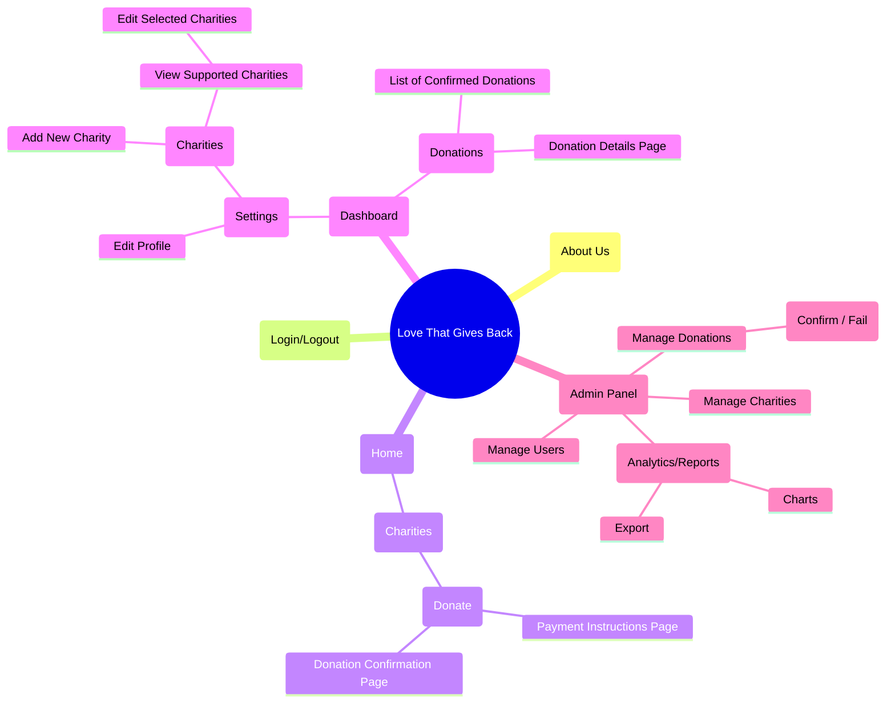
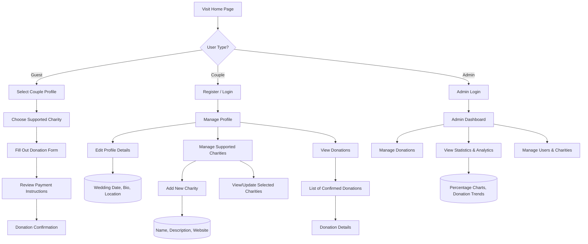

# **❤️ Love That Gives Back**

---

## **Concept Overview**  
**Theme:** A platform where users can explore and donate to various charity organizations tied to a couple's values.  
**Objective:**  
- Celebrate love by inspiring generosity.  
- Provide a seamless user experience for exploring charities and donating.  

---

## **Front-End Features**  

### 1. **Home Page (Landing Page)**  
- A hero section introducing the mission.  
- Links/buttons for logging in, exploring charities, and donating.  
- Display the wedding date with a countdown.  
- Highlight charity statistics (e.g., total donations).  

### 2. **User Authentication**  
- Registration: Name, email, password.  
- Login/Logout: Use Django Rest Framework for token-based authentication.  

### 3. **Dashboard**  
- Display personalized greetings.  
- Show donation history and progress.  
- Enable users to set donation goals.  

### 4. **Charity Pages (CRUD Features)**  
- Explore three charities with descriptions, images, and goals.  
- Allow users (admins) to create/update/delete charity profiles.  
- Enable commenting or "likes" on charities as a bonus feature.  

### 5. **Responsive Design**  
- Use bootstrap and CSS for a modern, responsive design.
- Ensure compatibility across devices.  

### 6. **API Integration**  
- **External API:** Display live progress using an external API, e.g., PayPal or Stripe for secure payments.  

---

## **Back-End Features**  

### 1. **Django Server**  
- RESTful API with Django Rest Framework.  
- Serve data to the React front-end.  

### 2. **Database**  
- PostgreSQL for scalable and reliable data management.  
- Store user profiles, charity data, and donation transactions.  

### 3. **User Authentication & Authorization**  
- Secure user login with hashed passwords.  
- Assign roles (admin, authenticated user, guest).  

### 4. **Donation Management**  
- CRUD functionality for donations.  
- Generate donation receipts.  

### 5. **Automated Testing**  
- Use Django's `unittest` framework to test API endpoints and functionality.  

---

## **Tools & Technologies**  

### **Front-End:**  
- React with React Router.  
- Axios for API calls.   

### **Back-End:**  
- Django with Django Rest Framework.  
- PostgreSQL database.  

### **Version Control & Deployment:**  
- Git for version control.  
- Deploy front-end and back-end with Render.  

---

## ER Diagram

---

## Sitemap

---

## User Flow

---

## User Stories

### Guest User (Wedding Guest)
- **As a guest, I want to view a couple’s profile and supported charities so that I can select one to donate to.**
- **As a guest, I want to fill out a donation form with my name, email, donation amount, and a personal message so that I can contribute a gift.**
- **As a guest, I want to review payment instructions and receive confirmation after submitting my donation so that I know my gift is acknowledged.**

### Wedding Couple (Profile Owner)
- **As a couple, I want to register and log in with a single user account so that I can manage my profile easily.**
- **As a couple, I want to view my profile details (wedding date, bio, location, etc.) so that guests know more about us.**
- **As a couple, I want to edit my profile details and update my supported charities so that I can choose which charities are displayed on my profile.**
- **As a couple, I want to see a list of confirmed donations (filtered by the charities I support) so that I can track the contributions and share my gratitude.**

### Admin
- **As an admin, I want to log in and view an admin dashboard so that I can manage all donations and user data.**
- **As an admin, I want to update the status of donations (mark them as confirmed or failed) so that the system reflects the correct payment status.**
- **As an admin, I want to view overall statistics and analytics (e.g., donation trends, percentages, reports) so that I can monitor platform performance.**
- **As an admin, I want to manage users and charities so that I can ensure data integrity and handle disputes if necessary.**

---

